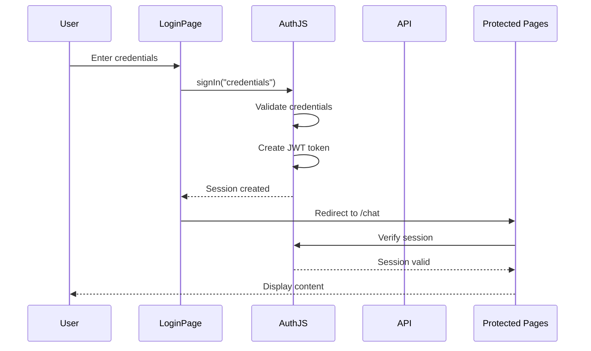
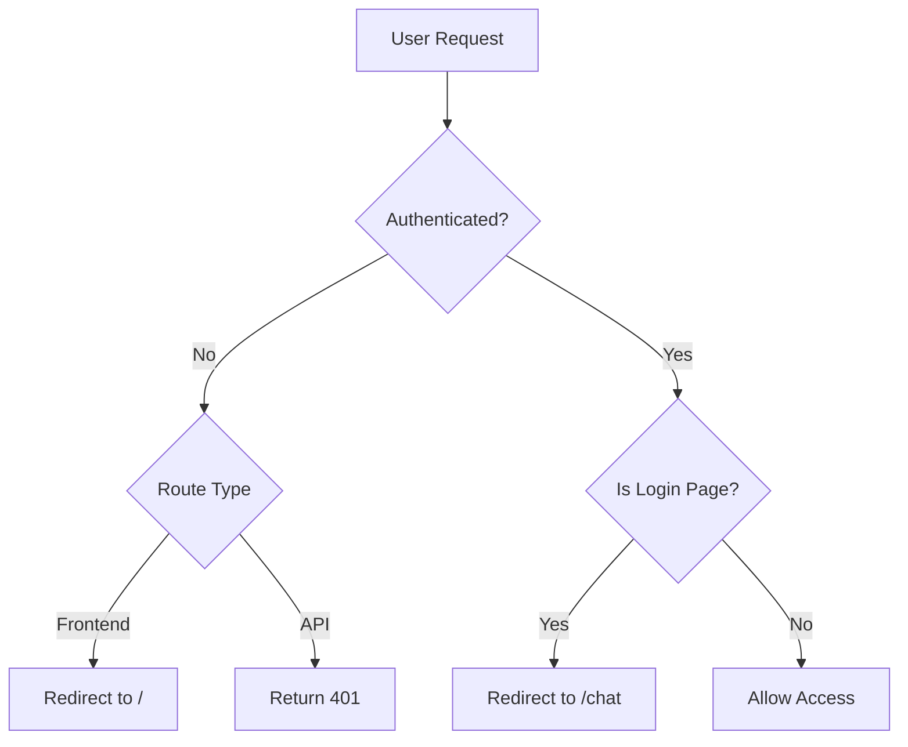

# Authentication System

## Overview

The application uses **Auth.js v5** (NextAuth) for authentication. Currently implemented with a Credentials provider for POC, with architecture designed for seamless migration to SSO (Keycloak).

## Current Implementation (POC)

### Authentication Provider
- **Provider**: Credentials (username/password)
- **Session Strategy**: JWT (no database required)
- **Status**: POC - Hardcoded test users

### Test Users
```
Username: alex.johnson    | Password: password | Merck ID: m277098
Username: sarah.chen      | Password: password | Merck ID: m283456
Username: michael.rodriguez | Password: password | Merck ID: m291234
```

## Architecture

### Authentication Flow



### Route Protection



## File Structure

```
/
├── auth.ts                          # Auth.js configuration
├── middleware.ts                    # API route protection
├── types/
│   └── next-auth.d.ts              # TypeScript type extensions
├── app/
│   ├── page.tsx                    # Login page
│   ├── api/
│   │   ├── auth/[...nextauth]/     # Auth.js handlers
│   │   └── profile/                # Protected profile API
│   └── profile/                    # Profile management page
├── components/
│   ├── auth/
│   │   ├── login-form.tsx         # Login form component
│   │   └── protected-route.tsx    # Client-side route guard
│   └── layout/
│       └── user-bar.tsx           # User info display with dropdown
└── hooks/
    └── use-profile.ts             # Profile data hooks
```

## User Data Structure

### Session Data (Immutable - from IDP)
```typescript
{
  user: {
    merck_id: string    // Format: m######
    name: string
    surname: string
    email: string
    image?: string
  }
}
```

### Profile Data (Editable - stored in DB)
```typescript
{
  // User preferences
  role?: string
  department?: string
  region?: string
  roleDescription?: string
  aiResponseStyleId?: string
  customResponseStyle?: string
  customInstructions?: string
}
```

## Components

### Login Page (`app/page.tsx`)
- Custom branded login form
- Username/password authentication
- Error handling and validation
- No signup/forgot password (SSO transition planned)

### Protected Route Component (`components/auth/protected-route.tsx`)
- Client-side authentication guard
- Redirects unauthenticated users to login
- Shows loading state during auth check

### User Bar (`components/layout/user-bar.tsx`)
- Displays user avatar with initials
- Shows full name and Merck ID
- Dropdown menu with:
  - User information display
  - Profile link
  - Sign out option

### Profile Page (`app/profile/page.tsx`)
- **Immutable Section**: Displays IDP data (read-only)
  - Merck ID, Name, Surname, Email
  - Badge: "From Merck SSO"
- **Editable Section**: User preferences
  - Role, Department, Region
  - Role Description
  - AI Response Style preferences
  - Custom Instructions
- **Inline Editing**: Double-click fields to edit
- **Bottom Bar**: Shows save/cancel buttons when changes exist

## API Endpoints

### Authentication
- `POST /api/auth/signin/credentials` - Login with credentials
- `GET /api/auth/session` - Get current session
- `POST /api/auth/signout` - Sign out user

### Profile
- `GET /api/profile` - Fetch user profile
  - Returns: Immutable IDP data + editable preferences
  - Auth: Required (JWT)

- `PATCH /api/profile` - Update profile preferences
  - Accepts: Only editable fields
  - Rejects: Attempts to modify immutable fields (400 error)
  - Auth: Required (JWT)

## Route Protection

### Frontend Protection
**Implementation**: Client-side with `ProtectedRoute` component

**Protected Routes**:
- `/chat` - Chat interface
- `/profile` - User profile
- `/favourites` - Favourited items
- `/projects` - Project management
- `/prompts` - Prompt library

**Behavior**:
- Unauthenticated users → Redirect to `/` (login)
- Authenticated users on `/` → Redirect to `/chat`

### Backend Protection
**Implementation**: Middleware in `middleware.ts`

**Protected APIs**: All `/api/*` routes except `/api/auth/*`

**Behavior**:
- Unauthenticated requests → Return 401 JSON response

## Migration to SSO

### Planned Migration Path

When migrating to SSO (Keycloak):

1. **Update `auth.ts` Provider**
   ```typescript
   // Replace Credentials provider with Keycloak
   providers: [
     Keycloak({
       clientId: process.env.KEYCLOAK_CLIENT_ID,
       clientSecret: process.env.KEYCLOAK_CLIENT_SECRET,
       issuer: process.env.KEYCLOAK_ISSUER,
     })
   ]
   ```

2. **Map IDP Claims**
   ```typescript
   callbacks: {
     async jwt({ token, account, profile }) {
       if (account && profile) {
         token.merck_id = profile.employee_id
         token.surname = profile.family_name
       }
       return token
     }
   }
   ```

3. **Connect Profile API to Database**
   - Replace mock data with PostgreSQL queries
   - Store user preferences in `user_profiles` table

4. **No UI Changes Required**
   - All UI components already designed for SSO
   - Immutable fields properly separated
   - Profile page structure remains the same

### Environment Variables for SSO

```bash
# Keycloak
KEYCLOAK_CLIENT_ID=your_client_id
KEYCLOAK_CLIENT_SECRET=your_client_secret
KEYCLOAK_ISSUER=https://your-keycloak-domain/realms/your-realm
```

## Security Considerations

### Current (POC)
- ⚠️ Plaintext password comparison
- ⚠️ Hardcoded test credentials
- ✅ JWT session strategy
- ✅ HTTP-only cookies (Auth.js default)

### Production Requirements
- ✅ SSO integration (Keycloak)
- ✅ OAuth 2.0 / OpenID Connect
- ✅ Token refresh handling
- ✅ Session expiration
- ✅ HTTPS only
- ✅ CSRF protection (Auth.js built-in)

## Key Features

### Immutable User Data
- Merck ID, Name, Surname, Email cannot be modified in app
- Managed by Merck SSO/IDP
- API validates and rejects modification attempts
- UI clearly indicates read-only status

### Profile Management
- **Inline Editing**: Double-click fields to edit
- **Change Detection**: Tracks unsaved changes
- **Bottom Bar**: Contextual save/cancel buttons
- **Optimistic Updates**: TanStack Query cache updates
- **Error Handling**: Toast notifications for success/failure

### User Experience
- Clean login page with Merck branding
- Fixed-position user bar in top-right corner
- Avatar with initials fallback
- Dropdown menu for quick actions
- Seamless redirect flows
- Loading states during auth checks

## Development Guidelines

### Adding New Protected Routes
1. Route is automatically protected by `AppLayout` wrapper
2. No additional configuration needed for frontend routes

### Adding New Protected API Routes
1. Place under `/api/*` (except `/api/auth/*`)
2. Middleware automatically protects
3. Access session with:
   ```typescript
   import { auth } from "@/auth"

   export async function GET(request: Request) {
     const session = await auth()
     if (!session?.user) {
       return NextResponse.json({ error: "Unauthorized" }, { status: 401 })
     }
     // ... protected logic
   }
   ```

### Accessing User Data

**Client-side**:
```typescript
import { useSession } from "next-auth/react"

function Component() {
  const { data: session, status } = useSession()

  if (status === "loading") return <Loader />
  if (!session) return <Unauthorized />

  return <div>{session.user.name}</div>
}
```

**Server-side**:
```typescript
import { auth } from "@/auth"

export default async function Page() {
  const session = await auth()
  return <div>{session?.user.name}</div>
}
```

## Troubleshooting

### Common Issues

**Session not persisting**
- Check `AUTH_SECRET` is set in `.env.local`
- Verify cookies are enabled in browser

**Redirect loops**
- Check middleware matcher patterns
- Verify `ProtectedRoute` logic

**401 on API calls**
- Ensure session exists before calling protected APIs
- Check middleware is not blocking auth endpoints

**Profile updates not saving**
- Verify TanStack Query cache invalidation
- Check API endpoint returns 200 status
- Ensure mutations are properly configured

## Testing

### Manual Testing Checklist
- [ ] Login with valid credentials
- [ ] Login with invalid credentials (should fail)
- [ ] Access protected route when logged out (redirect to login)
- [ ] Access login page when logged in (redirect to chat)
- [ ] View profile page (data loads)
- [ ] Edit profile fields (double-click)
- [ ] Save profile changes (success toast)
- [ ] Cancel profile changes (reverts)
- [ ] User bar displays correct information
- [ ] Sign out (redirect to login)
- [ ] API endpoints return 401 when unauthenticated

## Future Enhancements

### Short-term
- [ ] Connect profile API to PostgreSQL database
- [ ] Add password reset flow (if staying with credentials)
- [ ] Implement remember me functionality
- [ ] Add session timeout warnings

### SSO Migration
- [ ] Replace Credentials with Keycloak provider
- [ ] Map IDP claims to user object
- [ ] Implement token refresh
- [ ] Configure realm and client settings
- [ ] Configure group/role mapping

### Advanced
- [ ] Two-factor authentication (2FA)
- [ ] Device management
- [ ] Login activity tracking
- [ ] Security audit logs
- [ ] Passwordless authentication (WebAuthn)
