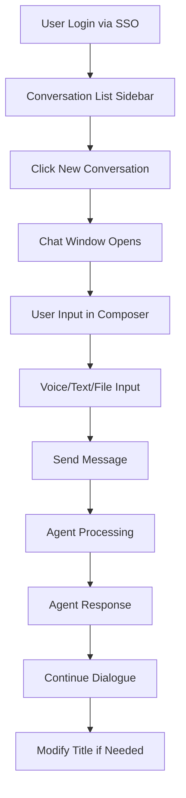
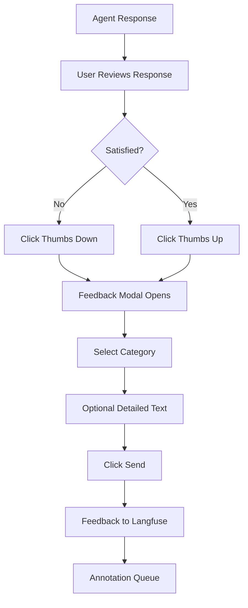
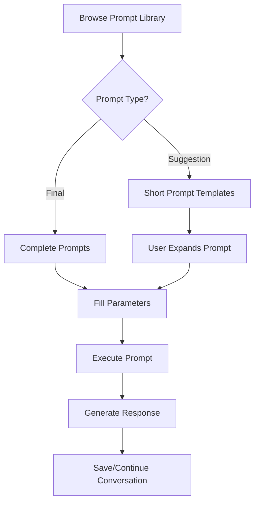
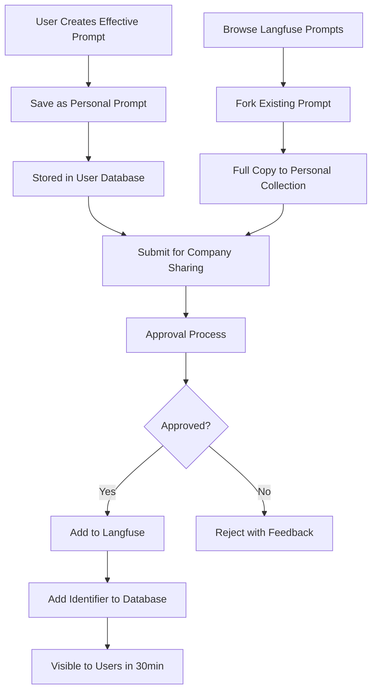

# Internal Chatbot Specification

## 3.1 Chat Interface

At it's core, this application allows chating with an agentic system. On the left side there will be a list of conversations (sidebar) and actions, which can be minimized. On the righ side we will have the chat window, which is divided horizontally on top, we will have the messages list and on the bottom we will have the input area, called Composer (as composing the message). For the messages list, this will be a scrollable area. Scrolling from the top we will have a chronological order of the conversation, having the latest messages on the bottom.
The composer aide of a text input field, which is growing, as we are writing the message, will allow:

- voice input (transcribed to the text)
- image input
- file input (non-graphic files)

All of those are composed into a single Human message.

#### Multi-turn dialogue support

Users will be able to create conversations with agents. Each conversation can have one or more human messages, what enables multi-turn dialogue, where users can ask follow-up questions to the agents. Users will be able to create, remove or archive conversations. Each conversation will have its title, which is modifiable by the user.

Archived conversations are not visible on the default list of the past conversations, but can be still search by the agentic system and used for generating a conversation context. There will be a dedicated section (most probably a tab or a group) where the archived conversations are displayed.

Deleted conversations are removed, there is no way to recover a deleted conversation. While deleting a conversation we will use a double opt-in, where users when removing a conversation, will receive a modal requiring to type in (or copy-paste) a fixed or dynamic word to confirm the deletion process. On this modal, we will also display information, that deleting a conversation is an irretrievable process.

#### Contextual conversation memory

We are influencing user questions based on past queries and general profile of the user. Moreover users will have a way to create `Projects`, that allow to add specific instructions (System Message) and documents, which will be used only withing conversations inside the project.

on top of that we are allowing users to select one of the predefiend way the agentic system should respond to users. For example:

- Normal
- Concise
- Learning
- Formal

When using normal response style, there is an assumption, that users will provide custom instructions to allign the response mode.

#### Conversation sharing

All of the publicly availabe chatbots such as Claude Desktop or ChatGPT support sharing conversations with others.

Original User -shares-> Another User

Once shared, the Another User sees all the humand and ai messages in the conversation. They can also see tools results (i.e., which urls we searched or what data was retrieved from the Snowflake)

There are three popular ways to share a chat:

- once a chat is shared, another user can contribute to it, that user messages are inside the same chat window
- once a chat is shared, if another user attempts to respond, it creates a follow-up conversation on the another user account
- once a chat is shared, only the original user can send messages, other users have a view-only access

One significatn problem with conversation sharing, is that we can share a conversation with restricted information, the another user should not have access. Due to this fact, the conversation sharing feature requires more analysis on the governance level.

#### Feedback tracking

Users can submit their fedback to the specific AI response. To maximize the chance of receiving feedback, we must make this process as simple for the user as possible. Due to this we suggest to have posivite - negative feedback rating. After giving a feedback user is prompted to optonally provide additional details.

There are two buttons

- thumb up - positive
- thumb down - negative

Upon click, we display a modal with selection and text fields. Inside the select field, can select a high-level group of the idea. Below are suggested categories, which are a subject to change.

- UI Bug
- Poor image / attachment understanding
- Did not fully follow my instruction
- Not factually correct
- Should search the Snowflake
- Issue with though process
- Other

The list will be modifiable via administration platform, and should reflect on the known and most common issues experienced.

In the multi-line text field, a user can add additional information about their decision. We will provide a placeholder to guide a user what could be typed.

On this modal, users can simply click `Send` without providing the additional context of their feedback. However, having two fields, creates a psychological suggestion to a user to provide at least one of the two things.

Clicking on `Cancel`, `X` icon in the top right corener of the modal, or outside the modal, will close it, and revert the feedback.

Feedback is message based, it will be sent to langfuse and added to a dedicated annotation queue where trained individuals will look into the messages and porvided context to triage and potentially improve relevant parts of the system.

User feedback with additional notes have a higher review priority than those messages without.

### 3.4 Prompt Library System

We can distinguish two types of prompts inside the library:

- suggestions - relatively short prompts that could point a user to create a more complex prompts themselves
- final prompts - carefully curated prompts, that are complete, and should provide satisfyable answers

Predefined prompts (shared with everyone at Merck) are store on langfuse. The contents of the prompts can be modifed in langfuse, without the need to rebuild the application. Langfuse has a built-in permissions and access management based on Merck SSO, what allows for a proper governance of the predefined prompts.

People can create and save custom prompts. Those prompts can be also forked from the predfiend prompts. The prompts can be only plain text or markdown, there is no support for prompt templates. If a user want to use xml-tag based prompts, they are using this in the plain text mode.

Moreover we have a dedicated table in the database, where we store langfuse prompts identifiers. Only langfuse prompts with those identifiers will be visible in the application. Adding a new indentifer in the table will make the prompt visible to the users withing the refresh window (initially suggested to be 30 minutes). Removing an identifier from the table will also remove the prompt from users. If users forked the prompt, it does not impact their prompts.

If a prompt is modifed in langfuse, it does not impact the prompts that forked from it. Forked prompts are user's full copies.

### 4.1 Chat Interface

Multi-modal Input Processing: The composer accepts voice, images, and non-graphic files as a single Human message.

> How will the system handle conflicting or contradictory information between voice transcription, image content, and file data within the same message?

The system is not doing smart composition or consolidation of the attached materials. Each piece of information will be transformed into tokens, as is. Due to this, users are responsible to provide valid and non-contadictory information to the system. Otherwise, the answers might not be satisfiable.

> What file size and format limitations will be enforced for uploads, and how will large files be processed without blocking the conversation flow?

In the initial phase, we will not provide any limits for uploads. To be declared whether we want to keep the files on s3 bucket. We would group files by the user account (i.e., X280977) as a prefix.

> Should voice transcription happen client-side or server-side, and how will you handle transcription errors or low-quality audio?

Voice transcription will be handled on the server side, by our Uptimize transcribe endpoint. By default the audio is being recorded and sent for processing.

Project Context Management: Projects allow custom instructions and documents that apply to all conversations within them.

> How will document embeddings be generated and stored for project-specific context retrieval?

In the initial phase, we are not going to use document embeddings. The files will be stored as is, and each request inside the project will use the full file. We plan to introduce custom vector store collections per project in the later stages.

> What happens when project documents conflict with general system knowledge or Snowflake data?

The agentic system might start hallucinations or provide confusing answers. In the initial stages, the user is responsible to provide clear information to the system. This might require to provide a proper onboarding training, before a user gets access.

> How will you handle document versioning when users update project files?

Users cannot update documents, to upload a new version, they have to remove the previous document and upload the new version.

### 4.4 Prompt Library - Technical Implementation Questions

Langfuse Integration Architecture: Prompts are stored in Langfuse with database identifiers controlling visibility.
  
> How will the 30-minute refresh window be implemented - polling, webhooks, or cache invalidation?

The system will be polling for prompts, if the checksum is the same, we will not be updating the cache.

> What happens when a user is mid-conversation using a prompt that gets removed from the visibility table?

Once a prompt is used, it is in a way cloned and added now as a part of the conversation (usually an initial message or a system message). Removing the prompt from the system does not impact the conversation.

> How will you handle concurrent modifications when multiple users fork the same prompt simultaneously?

We do not plan to support concurrent modifications. There will be only a few people responsible for the prompt engineering of the prompts in the Prompt Library. We will have a dedicated Jira project where the prompt improvements will be managed and planned.

Prompt Approval Workflow: Company-wide prompt sharing requires evaluation against security problems.

A prompt that will be shared publicly needs to go through evaluation process and needs to be checked against common security problems (vulnerabilities). Moreover there is a list of common AI attack vectors at [Mitre Atlas Matrix](https://atlas.mitre.org/matrices/ATLAS).

> What automated security scanning will be implemented beyond manual review?

We will implement offline testing methodologies. At the moment of writing this document, the suggested approach is to use [PromptFoo](https://www.promptfoo.dev/). PromptFoo already implements MITRE Atlas, and multiple OWASP vulnerability scans.

> How will you version control approved prompts when security requirements change?

When a security requirements are modified, we will have to rerun all the prompt validations against and in some situations, improve the prompts to matche the new criteria. This will create a new prompt version.

#### Basic Conversation Flow
1. User logs in via SSO → sees sidebar with conversation list
2. User clicks "New conversation" → chat window opens with composer at bottom
3. User types/speaks/uploads files in composer → sends message
4. Agent processes and responds → conversation appears chronologically
5. User continues multi-turn dialogue → can modify conversation title

#### Project-based Conversation Flow
1. User creates new project → adds custom instructions + documents
2. User starts conversation within project → system applies project context
3. User selects response style (Normal/Concise/Learning/Formal)
4. All conversations in project inherit context and style preferences

#### Feedback Flow
1. Agent responds to user query
2. User clicks thumbs up/down → modal opens with categories
3. User selects feedback category + optional detailed text
4. Clicks "Send" → feedback goes to Langfuse annotation queue

#### Manual Mode Selection Flow (MVP)
1. User starts new conversation
2. User manually selects reasoning/research mode if needed
3. Agent adapts behavior based on selected mode

### 5.4 Prompt Library Flows

#### Using Existing Prompts Flow
1. User browses prompt library → sees suggestions vs final prompts
2. User selects prompt → fills required parameters
3. System executes prompt with parameters → generates response
4. User can save results or continue conversation

#### Creating and Sharing Prompts Flow

1. User creates effective prompt during conversation
2. User saves as personal prompt → stored in user's database collection
3. User can fork existing Langfuse prompts → creates full copy in personal collection
4. Users submit prompt for company-wide sharing → requires approval process
5. Approved prompts added to Langfuse with identifier in database table
6. New prompts visible to all users within 30-minute refresh window

